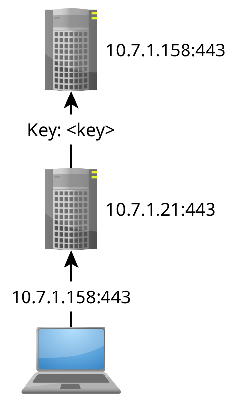
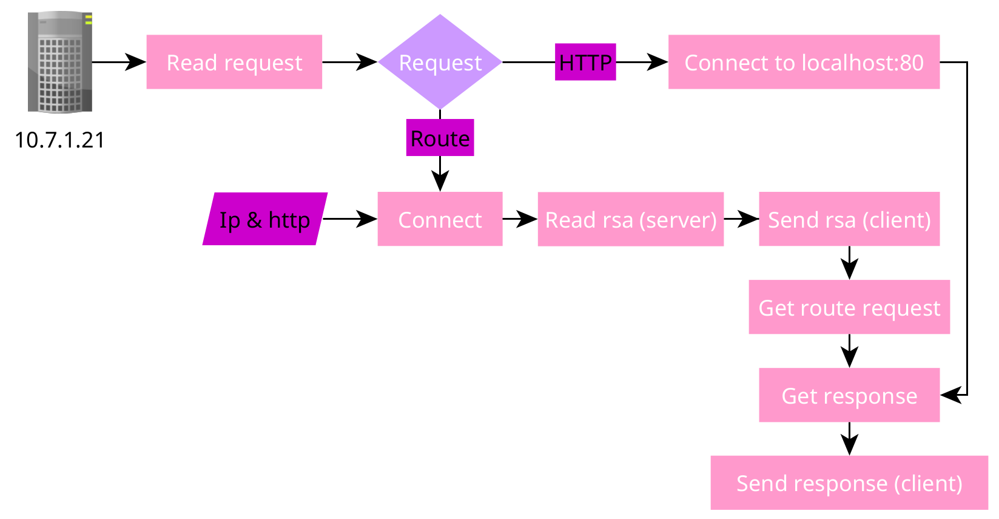

# Ghost Net
Ghost Net is a protocol and spec-sheet built for privacy against censorship and surveillance.

## What is the goal of Ghost Net?
Ghost Net is a strict ruleset and a protocol that makes it you undetectable and ensures full privacy.

## What you need to know
Everything you do on Ghost Net is unlinked to your identity, we use a public key generated by your device as a identity, think of it as your email, username, all in one string. We are also strict by how websites use your public key by our strict rules and protocols to prohibit abuse [Check here](#ghost-certification).

## FAQ
**Can i access normal websites hosted with Ghost Net?** Yes, GhostNet is meant to be a protocol that runs and hides as https, by hosting your app with a GhostNet server you are also contributing to [Ghost Chaining](#ghost-chaining).
**What is a GhostNet server?** A GhostNet server (aka Ghost router) is a router which is also a http server **wrapper**, routing to your actual server if the request is http [Read the protocol](#protocol).

## Ghost Chaining
Ghost Chaining is a network relay inside a functioning https server, because of it's design it's undetectable and any attempts on griefing will damage the internet.

### Protocol
`Client`: You
`Router`: The middle man
`Target`: The server you want to route to

1. `Client` -> Connect -> `Target`
2. `Client` -> (`ROUTE (ip:port)` or HTTP) -> `Router`
3. `Router` -> Connect -> `Target`
4. `Target` -> (`tls cert`) -> `Router` -> `Client`
5. `Client` -> (`tls cert`) -> `Router` -> `Target`
6. `Client` -> (`encrypted request`) -> `Router` -> `Target`
7. `Target` -> (`encrypted response`) -> `Router` -> `Client`
8. `Router` -> Conn close -> `Target`
9. `Router` -> Conn close -> `Client`

---

# Ghost Certification
Ghost Certified means that a website follows the rules for Ghost Net and is checked regularly by [Ghost Admins](#ghost-admins).

### The website must agree to the following guidelines:
1. **Must have a option for key auth instead of traditional email auth or phone number.**
2. **In the case that a user gets banned and is ban evading, give them details of why their banned accounts got banned and why the current one is getting banned in relation to the old ones, any information that is held back is prohibited.**
3. **In the case that a user is abusing children or committing crimes on your platform, notify the suspect before taking action, then take action, any information that is held back is prohibited and anyone who acts like a victim to catch these crimes should not be banned unless they share any CSAM or are a suspect of the crime, the action may also be delayed in the requirement of a investigation and/or questioning.**

## Ghost Admins
Ghost Admins are people who check on ghost certified servers regularly and are trusted by both Ghost Net and the Website admins to SSH into the machine to run checklists and make sure that the server is following our guidelines properly to ensure your privacy. Like our rules with [Ghost Certified](#ghost-certification), we also have very strict rules for Admins to prohibit admin abuse on servers, every single action done on the servers is going to be recorded, and if anything falls off the checklist the recording will be moved into questioning the culprit (alleged Admin).